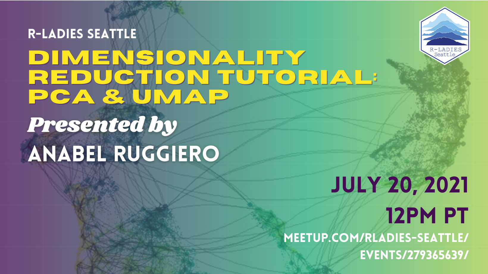

# Dimensionality Reduction Tutorial: PCA & UMAP

Readme courtesy of Isabella Velásquez

Please join us for a lunchtime R-Ladies meetup with Anabel Ruggiero. Anabel will guide us through a tutorial on dimensionality reduction. Dimensionality reduction is a useful technique for data visualization and as an initial layer of a model. This makes it a powerful tool in a data scientist's arsenal.

Anabel will go over the basics of the math and algorithms behind PCA, tSNE, and UMAP. Most of the time will be devoted to an R example implementing these algorithms.

Anabel Ruggiero is an unaffiliated researcher whose interests lie in the intersection of applied mathematics and software engineering. She received her doctorate in Chemical Engineering at Oklahoma State University, where she did research in the field of computational biosystems. Her current project is NNDescent.cpp, a reimplementation of and iteration upon PyNNDescent. This project is an entry in The Billion-Scale Approximate Nearest Neighbor Search Challenge hosted by NeurIPS 2021.

- LinkedIn: https://www.linkedin.com/in/anabel-ruggiero-138372114/
- Github: https://github.com/AnabelSMRuggiero 

-- How to follow Anabel’s tutorial --

This tutorial will require the uwot and ggplot2 packages to be installed in R.

If you want to watch the presentation and not run the code in real time, that is also fine.

Please reach out if you have any questions (email: seattle@rladies.org).

Additional resources:
- https://umap-learn.readthedocs.io/en/latest/how_umap_works.html
- https://arxiv.org/abs/1802.03426
- https://towardsdatascience.com/tsne-vs-umap-global-structure-4d8045acba17
- https://en.wikipedia.org/wiki/Principal_component_analysis
- Matrix Computations by Golub and Van Loan go over the steps behind the SVD, the primary algorithm that's used to implement PCA.
